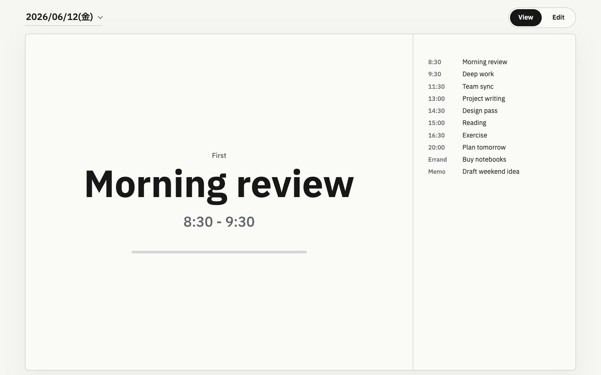
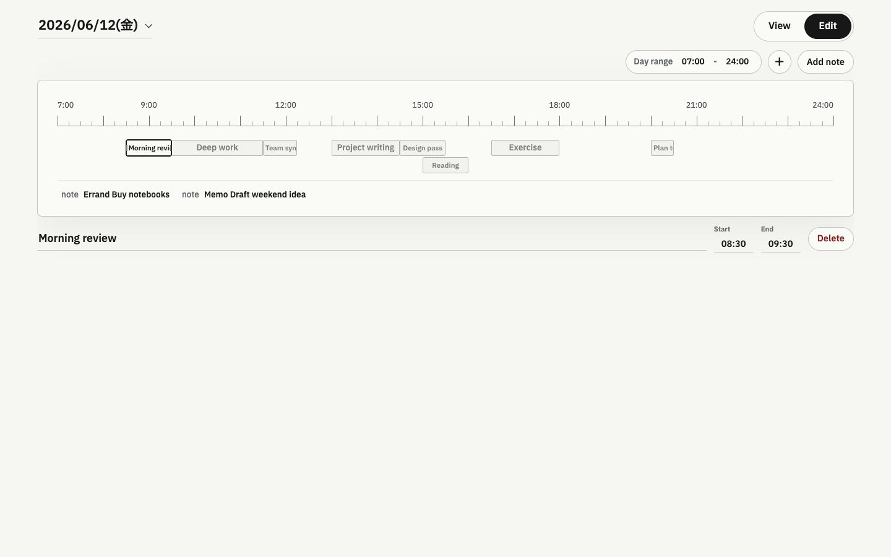

# Schedule for the Day

A minimalist daily planning app built with vanilla JavaScript and Python.

## Features

- 📅 Daily schedules by date
- ⏱️ Live "Now / Next" view
- 📊 Progress tracking for active tasks
- ✏️ Drag-and-drop schedule editing
- ↔️ Resize events directly on the timeline
- 📝 Notes alongside scheduled events
- 💾 SQLite persistence
- 🔄 localStorage fallback when the backend is unavailable
- 📱 Responsive design

## Screenshots

Screenshots use demo data only.

### View Mode



### Edit Mode



## Getting Started

### Requirements

- Python 3.9+

### Run

```bash
python server.py
```

Open:

```text
http://127.0.0.1:4173
```

## Project Structure

```text
.
├── app.js        # Frontend logic
├── styles.css    # UI styling
├── index.html    # Main page
├── server.py     # API + static file server
├── schedule.db   # SQLite database (generated)
├── docs/
│   └── screenshots/
│       ├── view-mode.jpg
│       └── edit-mode.jpg
├── README.md
├── LICENSE
└── .gitignore
```

## Data Model

### Event

```json
{
  "id": "uuid",
  "kind": "event",
  "title": "Study",
  "start": 570,
  "end": 720
}
```

### Note

```json
{
  "id": "uuid",
  "kind": "note",
  "title": "Lunch",
  "label": ""
}
```

Time values are stored as minutes from midnight.

## Tech Stack

- Vanilla JavaScript
- HTML5
- CSS3
- Python
- SQLite

## License

MIT License
