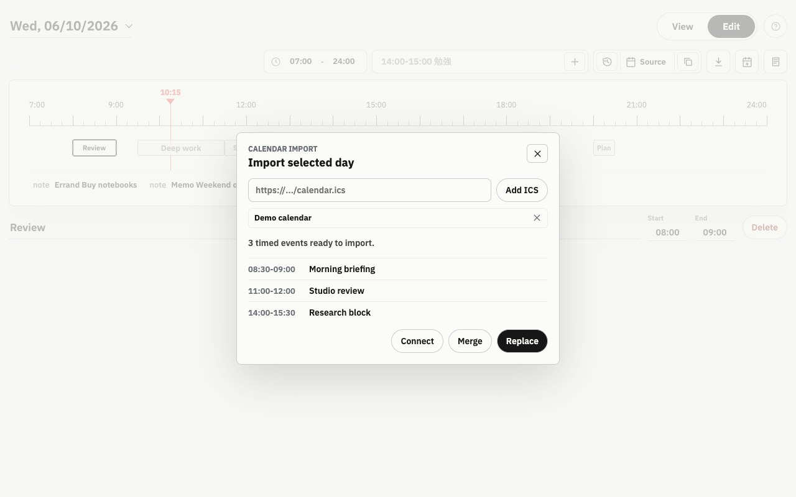

# Schedule for the Day

A focused daily planner for turning calendar noise into a timeline you can actually follow.

Instead of managing another full calendar, this app gives you one clean view of today: what is happening now, what comes next, and how the rest of the day is shaped. Pull in events from Google Calendar or remote ICS feeds, then adjust the local plan without changing the original calendars.


## Why Use It

- **Start from real calendars, finish with a usable day plan.** Import timed events from Google Calendar, `.ics`, or `webcal://` feeds, then merge or replace the selected day.
- **Stay oriented.** View mode highlights the current block, the next block, remaining time, and a compact full-day list.
- **Edit faster than a calendar app.** Drag blocks, resize them on a single horizontal timeline, or quick-add with text like `14:00-15:00 Study`.
- **Keep imports read-only.** Local edits never write back to Google Calendar or remote ICS feeds.
- **Own the data.** Plans are stored in local SQLite, with a browser `localStorage` fallback if the backend is unavailable.
- **No build step.** Vanilla JavaScript, CSS, Python, and SQLite.

## Screenshots

Screenshots use demo data and simulate a mid-morning planning session.

### View Mode


### Edit Mode


### Calendar Import



## Quick Start

Requirements:

- Python 3.9+

Run:

```bash
python server.py
```

Open:

```text
http://127.0.0.1:4173
```

## Calendar Import

Calendar import is manual and read-only. It imports timed events into the selected day; it does not write changes back to Google Calendar or remote ICS calendars.

Open **Edit**, click the import button, then choose how to bring events in:

- **Merge** adds imported events that are not already present.
- **Replace** swaps the local day with the imported events.

All-day events are skipped so the timeline stays useful. Google recurring events are expanded by Google; simple daily and weekly recurring ICS events are expanded locally.

### ICS Links

Paste a public or private feed URL into the import dialog and click **Add ICS**. Saved links are stored in the local SQLite database and included every time you import.

Supported URL schemes:

```text
https://example.com/calendar.ics
webcal://example.com/calendar.ics
```

### Google Calendar

1. Create an OAuth client in Google Cloud Console.
2. Add this authorized redirect URI:

```text
http://127.0.0.1:4173/api/google/callback
```

3. Download the OAuth client JSON and save it as:

```text
google_credentials.json
```

You can also use environment variables:

```bash
GOOGLE_CLIENT_ID=... GOOGLE_CLIENT_SECRET=... python server.py
```

Google requires the redirect URI to match exactly. These are different URIs:

```text
http://127.0.0.1:4173/api/google/callback
http://127.0.0.1:4174/api/google/callback
http://localhost:4173/api/google/callback
```

To force one callback URL regardless of the browser address:

```bash
GOOGLE_REDIRECT_URI=http://127.0.0.1:4173/api/google/callback python server.py
```

## Controls

- `E` switches to Edit mode.
- `V` switches to View mode.
- `/` focuses quick add.
- `N` creates an event.
- `Shift` + `N` creates a note.
- Arrow keys move the selected event by 5 minutes.
- `Shift` + arrow keys resize the selected event.
- `Ctrl`/`Cmd` + `Z` undo, `Ctrl`/`Cmd` + `Y` redo.

Press `?` in the app for the full shortcut sheet.

## Data Model

Events are stored as minutes from midnight:

```json
{
  "id": "uuid",
  "kind": "event",
  "title": "Study",
  "start": 570,
  "end": 720
}
```

Notes sit alongside the timeline:

```json
{
  "id": "uuid",
  "kind": "note",
  "title": "Buy notebooks",
  "label": "Errand"
}
```

## Project Structure

```text
.
├── app.js                 # Frontend logic
├── styles.css             # UI styling
├── index.html             # Main page
├── server.py              # API + static file server
├── schedule.db            # SQLite database (generated)
├── google_credentials.json # Google OAuth credentials (local, ignored)
├── .google-token.json     # Google OAuth token (local, ignored)
├── docs/
│   └── screenshots/
│       ├── view-mode.jpg
│       ├── edit-mode.jpg
│       └── import-calendar.jpg
├── README.md
├── LICENSE
└── .gitignore
```

## Tech Stack

- Vanilla JavaScript
- HTML5
- CSS3
- Python
- SQLite

## License

MIT License
